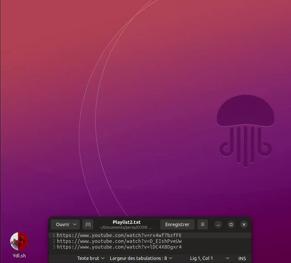

# Youtube Playlist Downloarder

- A simple GUI to download your own Youtube playlists 
- Une ptite interface graphique pour télécharger ses playlists Youtube

*Le script tourne sur linux des docstring sont présentes pour permettre un usage sur window (les icones, images et chemin de fichier n'étant pas pris en compte de la même manière.) / This script is running on linux some docstring indicate how to change it for Windows among other things that images and path are not processed the same on Window and Linux*

# Lancer depuis un terminal / Run from terminal : 

- Se placer depuis le terminal dans le dossier où l'on exécute le script / From terminal go in directory where you will execute the script :

- Avant toute chose on clone le répository git / Clone repository:

    git clone: https://github.com/LGD-P/YoutubePlaylistDownloarder.git

-Une fois le projet cloné on crée et on active l'environnement virtuel / creat virtual environement:

    python3 -m venv env

-Suivi de / activate it:

    source env/bin/activate

-Puis on lance l'installation des modules nécessaires au fonctionnement du script / install dependancies :

    pip install -r requirements.txt

-Il n'y a plus qu'à exécuter le script / execute the script:

    python3 main.py

# Lancer comme un exécutable Windows / Run as executable from .sh file :

Créer et écrire un fichier  .sh / creat and write.sh file: 

    touch Ydl.sh
    nano Ydl.sh

-1 : Ecrire le shebang / Write Shebang

-2 : pointer vers le fichier main.py / point to the right path

-3 : Ecrire la commande pour exécuter le script / Write command to execute script:

    #!/bin/bash
    
    cd your_path/to_folder/containing_main.py
    
    python3 main.py

*save .sh with ctrl + x*

-4 : Rendre le fichier .sh executable / make .sh file executable:

    sudo chmod +x Ytl.sh 

*Aussi simple que ça.*

# Démo:

*Pour ce que qui ne veulent pas se compliquer la vie, un .exe est dispo... et si vous utiliser Linux il y à toujours wine / For those who dont want complicate thing, you still have .exe, and if you're using Linux you still can run wine.*